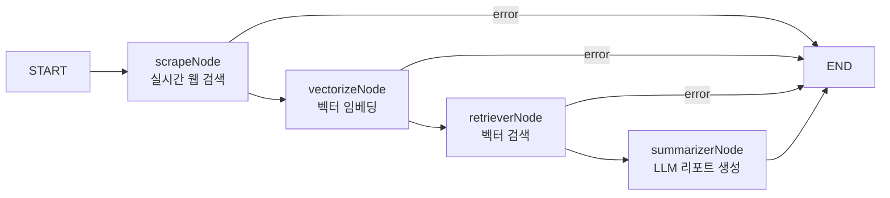

# API (Backend) 개발 가이드

> **목적:** SmartShopper AI 백엔드 API의 LangGraph 에이전트 아키텍처, SSE 스트리밍, 보안 정책, 외부 API 연동 규칙을 정의합니다.  
> 새로운 노드/엔드포인트 추가 시 본 문서를 먼저 확인하고 기존 패턴을 따르세요.

---

## 1. 기술 스택

| 항목 | 기술 | 버전 |
|---|---|---|
| 런타임 | Node.js + tsx (TypeScript 직접 실행) | Node 20+ |
| 프레임워크 | Express | 5+ |
| 에이전트 엔진 | @langchain/langgraph | 0.2+ |
| 입력 검증 | Zod | 3.23+ |
| API 문서 | Swagger (swagger-jsdoc + swagger-ui-express) | - |
| 외부 LLM | OpenAI (gpt-4o-mini) / Google Gemini (gemini-2.5-flash) | - |

---

## 2. 디렉토리 구조 규칙

```
api/
├── src/
│   ├── server.ts             # Express 서버 + SSE 엔드포인트 + Swagger
│   ├── agents/
│   │   ├── state.ts          # AgentState 인터페이스 (전체 파이프라인 상태 타입)
│   │   ├── workflow.ts       # LangGraph StateGraph 워크플로우 정의
│   │   └── nodes/
│   │       ├── scrape.ts     # Node 1: 실시간 웹 스크래핑 + LLM 상품 추출
│   │       ├── vectorize.ts  # Node 2: 벡터 임베딩 (현재 패스스루)
│   │       ├── retriever.ts  # Node 3: 벡터 검색/매칭 (현재 패스스루)
│   │       └── summarizer.ts # Node 4: LLM 기반 추천 리포트 생성
│   ├── schemas/
│   │   └── validation.ts     # Zod 스키마 (UserQuery, ProductData)
│   ├── utils/
│   │   └── urlValidator.ts   # WHATWG URL 화이트리스트 검증기
│   └── test_workflow.ts      # LangGraph 워크플로우 단독 테스트
└── package.json
```

### 디렉토리 규칙

| 디렉토리 | 역할 | 원칙 |
|---|---|---|
| `agents/nodes/` | LangGraph 노드 구현체 | **Single Responsibility**: 1 노드 = 1 책임 |
| `agents/` | 상태 정의 + 워크플로우 그래프 | 노드 조합 및 조건부 분기만 정의 |
| `schemas/` | Zod 입력/출력 검증 스키마 | 모든 외부 입력에 대해 스키마 검증 필수 |
| `utils/` | 공통 유틸리티 함수 | 순수 함수만 (상태 의존 금지) |

---

## 3. LangGraph 파이프라인 아키텍처

### 3-1. 상태 흐름도 (State Flow)



### 3-2. AgentState 인터페이스

```typescript
export interface Product {
  id: string;
  name: string;
  price: number;
  mallName: string;
  url: string;
  rawReviewText?: string;
}

export interface AgentState {
  userQuery: string;          // 사용자 검색어
  products: Product[];        // scrapeNode에서 수집된 상품 목록
  retrievedProducts: Product[];  // retrieverNode에서 매칭된 상품
  report: string;             // summarizerNode에서 생성된 마크다운 리포트
  error?: string;             // 에러 발생 시 메시지
}
```

### 3-3. 노드 구현 패턴

```typescript
// 모든 노드는 이 시그니처를 따릅니다
export async function nodeFunction(
  state: AgentState
): Promise<Partial<AgentState>> {
  try {
    // 1. 입력 검증 (Zod)
    const validationResult = SomeSchema.safeParse(state.someField);
    if (!validationResult.success) {
      return { error: `Validation Error: ${validationResult.error.message}` };
    }

    // 2. 비즈니스 로직 수행
    const result = await doSomething(state);

    // 3. 결과 반환 (상태 일부만 업데이트)
    return { someField: result };
  } catch (error: any) {
    // 4. 에러 분기 처리 (workflow에서 조건부 라우팅)
    console.error("[NodeName] 에러:", error);
    return { error: `Node failed: ${error.message || error}` };
  }
}
```

### 3-4. 조건부 라우팅 (에러 분기)

```typescript
// workflow.ts — 에러 발생 시 즉시 END로 분기
workflow.addConditionalEdges("scrape", (state: AgentState) => {
  return state.error ? END : "vectorize";
});
```

> [!IMPORTANT]
> 모든 노드 간 전환에서 `state.error`를 체크하여 에러가 발생한 경우 즉시 파이프라인을 중단합니다.  
> 이를 통해 실패한 노드 이후의 불필요한 API 호출 비용을 절약합니다.

---

## 4. 실시간 웹 검색 아키텍처 (scrapeNode)

### 4-1. 검색 전략

```
사용자 쿼리 → DuckDuckGo HTML 검색 → 원시 텍스트 추출
                                        ↓
                             LLM (OpenAI / Gemini)
                                        ↓
                             구조화된 상품 JSON 배열
```

### 4-2. DuckDuckGo 검색

```typescript
const searchUrl = `https://html.duckduckgo.com/html/?q=${encodeURIComponent(
  query + ' 쇼핑 최저가 쿠팡 네이버쇼핑'
)}`;

const response = await fetch(searchUrl, {
  headers: {
    'User-Agent': 'Mozilla/5.0 (Windows NT 10.0; Win64; x64) ...'
  }
});
```

> [!NOTE]
> DuckDuckGo HTML 버전을 사용하는 이유: JavaScript가 필요 없고, API 키 불필요하며, 속도가 빠릅니다.

### 4-3. LLM 추출 (OpenAI 우선 → Gemini 폴백)

```typescript
// OpenAI 키가 있으면 gpt-4o-mini로 먼저 시도
if (openaiKey) {
  // ... OpenAI API 호출
}

// 실패 시 Gemini로 폴백
if (geminiKey) {
  // ... Gemini API 호출
}
```

### 4-4. 폴백 데이터 체계

실시간 검색이 실패한 경우를 위한 로컬 폴백 데이터가 존재합니다:

| 키워드 | 폴백 상품 |
|---|---|
| 노트북, laptop | MacBook Pro 14, Dell XPS 17 |
| 청소기, 다이슨 | 다이슨 V15, 삼성 비스포크 제트 |
| 드라이기, 에어랩 | 다이슨 슈퍼소닉, 유닉스 SUPER D+ |
| 기타 (catch-all) | 프리미엄/가성비 동적 생성 |

### 4-5. URL 생성 규칙

| 쇼핑몰 | URL 패턴 | 비고 |
|---|---|---|
| 네이버쇼핑 | `msearch.shopping.naver.com/search/all?query=...` | 모바일 도메인 사용 (봇 차단 우회) |
| 쿠팡 | `www.coupang.com/np/search?q=...` | 표준 검색 URL |
| 다나와 | `search.danawa.com/dsearch.php?query=...` | 가격비교 |

> [!CAUTION]
> **절대 `search.shopping.naver.com` (PC 도메인)을 사용하지 마세요.**  
> localhost에서 리퍼러가 유출되면 `device_prevent.nhn` 로봇 차단 페이지로 리다이렉트됩니다.  
> 항상 `msearch.shopping.naver.com` (모바일 도메인)을 우선 사용합니다.

---

## 5. SSE (Server-Sent Events) 스트리밍 API

### 5-1. 엔드포인트 명세

```
GET /api/recommend/stream?q={검색어}

응답: text/event-stream

이벤트 데이터 포맷:
  { "type": "products", "products": [...] }   # 상품 목록
  { "type": "report", "text": "..." }          # 리포트 라인 (순차 전송)
  { "type": "error", "message": "..." }        # 에러 메시지
```

### 5-2. SSE (Server-Sent Events) 스트리밍 패턴

검색 결과 페이지의 실시간 데이터 수신에 사용합니다. **절대 API 주소를 하드코딩하거나 상대 경로(`/api/...`)만 단독으로 사용하지 않습니다.**

```tsx
// 환경 변수 최우선 참조 + 로컬/운영 백업 도메인 다이내믹 바인딩
const API_BASE_URL = import.meta.env.VITE_API_URL || 
  (window.location.hostname === 'localhost' 
    ? 'http://localhost:3001' 
    : '[https://smart-shopper-api.onrender.com](https://smart-shopper-api.onrender.com)');

useEffect(() => {
  if (!query) return;
  setIsStreaming(true);

  // 슬래시(/) 중복 방지를 위한 URL 정규화 후 연결
  const cleanBaseUrl = API_BASE_URL.replace(/\/$/, '');
  const eventSource = new EventSource(
    `${cleanBaseUrl}/api/recommend/stream?q=${encodeURIComponent(query)}`
  );
```

---

## 6. 입력 검증 (Zod 스키마)

### 6-1. 사용자 쿼리 검증

```typescript
export const UserQuerySchema = z.object({
  query: z.string()
    .min(2, { message: "검색어는 최소 2글자 이상" })
    .max(100, { message: "검색어는 최대 100글자까지" })
    .trim(),
});
```

### 6-2. 상품 데이터 검증

```typescript
export const ProductDataSchema = z.object({
  id: z.string().uuid().or(z.string().min(1)),
  name: z.string().min(1).max(255),
  price: z.number().nonnegative().max(100_000_000),
  mallName: z.string().min(1).max(50),
  url: z.string().url(),
  rawReviewText: z.string().max(5000).optional(),
});
```

> [!WARNING]
> 모든 외부 입력(사용자 쿼리, LLM 응답, 웹 스크래핑 결과)은 반드시 Zod 스키마를 통과해야 합니다.  
> 미검증 데이터가 파이프라인에 유입되면 다운스트림 노드에서 예측 불가한 오류가 발생합니다.

---

## 7. URL 보안 검증 (WHATWG 표준)

```typescript
// utils/urlValidator.ts
export function validateShoppingUrl(urlString: string): boolean {
  try {
    const parsedUrl = new URL(urlString);  // WHATWG URL 생성자
    const allowedProtocols = ['http:', 'https:'];
    
    if (!allowedProtocols.includes(parsedUrl.protocol)) {
      console.warn(`[Security] Blocked protocol: ${parsedUrl.protocol}`);
      return false;
    }
    return true;
  } catch {
    return false;
  }
}
```

> [!CAUTION]
> `javascript:`, `data:`, `vbscript:` 등의 프로토콜을 통한 XSS 공격을 차단합니다.  
> 리포트 본문에 포함되는 모든 아웃링크 URL은 `validateShoppingUrl()`을 통과해야만 렌더링됩니다.

---

## 8. 환경 변수

```env
# .env (프로젝트 루트)
GEMINI_API_KEY=your_gemini_api_key
OPENAI_API_KEY=your_openai_api_key
PORT=3001
```

> [!NOTE]
> 환경 변수 로드 경로: `dotenv.config({ path: path.resolve(__dirname, '../../../.env') })`  
> `.env` 파일은 `api/` 디렉토리가 아닌 **프로젝트 최상위 루트**에 위치해야 합니다.

---

## 9. 새 노드 추가 절차

1. `agents/nodes/` 에 새 노드 파일 생성
2. `AgentState` 인터페이스에 필요한 필드 추가 (`state.ts`)
3. `workflow.ts`에 노드 등록 + 조건부 엣지 추가
4. 입력/출력에 대한 Zod 스키마 정의 (`schemas/validation.ts`)
5. 에러 시 `{ error: "..." }` 반환하여 파이프라인 중단 분기 보장

```typescript
// workflow.ts에 새 노드 추가 예시
workflow
  .addNode("newNode", newNodeFunction)
  .addConditionalEdges("previousNode", (state) => {
    return state.error ? END : "newNode";
  });
```

---

## 10. 실행 및 검증

```bash
# 개발 서버 (핫 리로드)
npm run dev        # → tsx watch src/server.ts → http://localhost:3001

# Swagger API 문서
# → http://localhost:3001/api-docs

# 정적 디자인 파일 직접 접근 (designs/ 폴더 서빙)
# → http://localhost:3001/search_result_ko.html?q=검색어

# 워크플로우 단독 테스트
npx tsx src/test_workflow.ts
```

## 11. Render.com 백엔드 배포 및 트러블슈팅 가이드

API 서버를 Render.com에 배포할 때 발생하는 TypeScript 환경 충돌을 방지하기 위한 표준 세팅입니다.

### 11-1. Render Web Service 설정 명세
| 설정 항목 | 입력 값 | 비고 |
|---|---|---|
| **Runtime** | `Node` | Python 캐시 락 발생 시 서비스 삭제 후 Node로 재생성 |
| **Root Directory** | `smart-shopper-agent/api` | 백엔드 폴더 명시 |
| **Build Command** | `npm install && npx tsc` | 타입스크립트 컴파일 |
| **Start Command** | `node src/server.js` | Root Directory 기준 상대 경로 실행 |

### 11-2. TypeScript 컴파일러 충돌 방지 (`tsconfig.json`)
Render의 `tsc --init` 자동 생성 설정과 로컬 모듈 시스템이 충돌하여 도움말만 출력되고 빌드가 중단되는(`TS5052` 등) 현상을 막기 위해, `api/` 루트에 아래의 완화된 설정 파일을 고정적으로 유지합니다.

```json
{
  "compilerOptions": {
    "target": "ES2022",
    "module": "NodeNext",
    "moduleResolution": "NodeNext",
    "esModuleInterop": true,
    "skipLibCheck": true,
    "strict": false,
    "strictNullChecks": false,
    "exactOptionalPropertyTypes": false,
    "verbatimModuleSyntax": false
  },
  "include": ["src/**/*"]
}

### 12. Vercel 배포 및 환경 변수 가이드
프론트엔드 앱을 Vercel에 배포할 때 백엔드와의 통신을 연결하는 표준 절차입니다.

12-1. 환경 변수 등록
Vercel 대시보드 Settings > Environment Variables에 Render 백엔드 주소를 등록합니다.

Key: VITE_API_URL

Value: https://smart-shopper-api.onrender.com (끝에 슬래시 제외)

12-2. 배포 캐시 초기화 (Redeploy)
Vercel은 환경 변수 등록 후, 변수를 브라우저 코드에 주입하기 위해 반드시 재배포가 필요합니다.

Deployments 탭 ➔ 최신 빌드 옵션 ➔ Redeploy 실행

⚠️ 주의: 팝업창에서 Use Existing Build Cache 옵션을 반드시 해제해야 이전 도메인으로 쏘는 캐시 버그(404 Not Found)를 막을 수 있습니다.

---

## 13. Supabase DB 및 LangGraph Saver 연동 가이드

에이전트의 영속성(Persistence) 확보와 멀티 세션 관리를 위해 Supabase의 PostgreSQL 데이터베이스를 연동하는 표준 아키텍처 가이드입니다.

### 13-1. Supabase 연동 기술 스택
- **Database**: PostgreSQL (Supabase Cloud)
- **Driver**: `pg` 및 `@types/pg`
- **LangGraph Checkpointer**: `@langchain/langgraph-checkpoint-postgres`

### 13-2. LangGraph PostgresSaver 초기화 및 워크플로우 등록 패턴
데이터베이스 연결을 안전하게 초기화하고 에이전트의 대화 히스토리 및 이전 상태(State) 정보를 영구 관리합니다.

```typescript
import { Pool } from 'pg';
import { PostgresSaver } from '@langchain/langgraph-checkpoint-postgres';
import { workflow } from './workflow';

// 1. Connection Pool 구성 (환경변수 DATABASE_URL 연동)
const connectionString = process.env.DATABASE_URL;

if (!connectionString) {
  console.warn("[Database] DATABASE_URL이 지정되지 않았습니다. 인메모리 세이버로 대체하거나 API 에러가 발생할 수 있습니다.");
}

const pool = new Pool({
  connectionString,
  ssl: {
    rejectUnauthorized: false // Supabase SSL 통신 필수 옵션
  }
});

// 2. PostgresSaver 인스턴스 생성
const checkpointer = new PostgresSaver(pool);

// 3. 최초 서버 구동 시 백업에 필요한 DB 테이블 자동 생성
// (Express 기동 또는 에이전트 서비스 로드 시 1회 비동기 실행 필요)
export async function initializeDatabase() {
  try {
    await checkpointer.setup();
    console.log("[Database] Supabase PostgreSQL Checkpointer 테이블 준비 완료.");
  } catch (error) {
    console.error("[Database] 데이터베이스 초기화 실패:", error);
  }
}

// 4. 워크플로우 컴파일 시 checkpointer 등록
export const app = workflow.compile({
  checkpointer: checkpointer
});
```

### 13-3. 세션별 대화 관리 및 호출 패턴
API 엔드포인트에서 각 요청을 구분하기 위해 `configurable.thread_id` 옵션을 실어 호출합니다.

```typescript
// Express 라우터 예시
server.get('/api/recommend/stream', async (req, res) => {
  const query = req.query.q as string || '';
  const sessionId = req.headers['x-session-id'] as string || 'default-session';

  // ... SSE header 설정 생략 ...

  try {
    // thread_id를 전달하여 해당 사용자의 이전 대화 맥락 복구 및 현재 상태 자동 보존
    const config = {
      configurable: {
        thread_id: sessionId
      }
    };

    const resultState = await app.invoke({ userQuery: query }, config);
    // ... 데이터 스트리밍 처리 ...
  } catch (error) {
    // ... 에러 처리 ...
  }
});
```

### 13-4. 보안 및 백엔드 설정 규칙
1. **Connection String 은닉**: `DATABASE_URL` 정보는 절대 코드나 Public GitHub 저장소에 하드코딩해서는 안 됩니다.
2. **IP Whitelisting / SSL**: Supabase와 Render 통신 시 반드시 SSL(`ssl: { rejectUnauthorized: false }`) 설정을 명시해야 접속 거부를 막을 수 있습니다.
3. **Connection Pool 관리**: 서버 재기동 시 컨넥션 누수를 막기 위해 싱글톤 패턴으로 pool 인스턴스를 유지 관리하십시오.

## 14. LangSmith AI 관제 및 모니터링 (Observability)

LangGraph 에이전트의 사고 과정, LLM 프롬프트, 소모 토큰을 추적하고 사용자 피드백을 수집하기 위한 표준 세팅입니다.

### 14-1. 환경 변수 세팅 (필수)
Render 대시보드 환경 변수에 아래 값을 주입하면 코드 수정 없이 백그라운드 추적이 시작됩니다.
```env
LANGCHAIN_TRACING_V2=true
LANGCHAIN_API_KEY=lsv2_... (발급받은 키)
LANGCHAIN_PROJECT=SmartShopper-Prod

### 14-2. 식별자(Metadata) 및 Run ID 동적 주입
랭스미스에 쌓인 수많은 로그 중 특정 에러나 피드백을 쉽게 추적하기 위해, server.ts에서 워크플로우 실행 시 태그와 메타데이터를 명시적으로 주입합니다.

// src/server.ts (LangGraph invoke 실행부)
import crypto from 'crypto';

// FO로 전달하여 피드백 연결 고리로 사용할 고유 ID
const runId = crypto.randomUUID(); 

const resultState = await app.invoke(
  { userQuery: query },
  {
    tags: ["prod-v1.0", "search-intent"],
    metadata: { client: "web-fo" },
    runId: runId // 명시적 ID 부여
  }
);

### 14-3. 사용자 피드백 수집 엔드포인트
프론트엔드에서 전송한 '좋아요/싫어요' 데이터를 랭스미스의 해당 Trace 로그에 직접 기록합니다.

// src/server.ts (라우터 추가)
import { Client } from "langsmith";
const langsmithClient = new Client();

server.post('/api/feedback', async (req, res) => {
  const { runId, score } = req.body; // score: 1 (좋음) or 0 (나쁨)
  
  try {
    // 랭스미스의 해당 runId 로그에 점수 기록
    await langsmithClient.createFeedback(runId, "user_score", { score });
    res.status(200).send({ status: 'ok' });
  } catch (e) {
    console.error('LangSmith Feedback Error:', e);
    res.status(500).send({ error: 'Feedback record failed' });
  }
});

