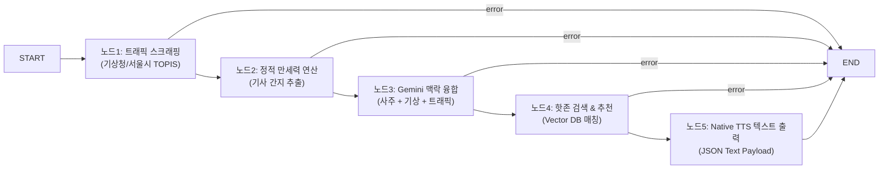

# UNSU Platform API (Backend) 개발 가이드 (v2.0)

> **목적:** 프리미엄 택시 기사 플랫폼의 백엔드 시스템인 Node.js + LangGraph 기반 자율 상태 머신, 외부 연동(핀테크/공공 API), 보안 정책을 정의합니다.

---

## 1. 아키텍처 개요 및 기술 스택

| 항목 | 기술 | 비고 |
|---|---|---|
| 런타임 | Node.js (TypeScript) | - |
| 프레임워크 | Express | REST API 및 실시간 데이터 라우팅 |
| 에이전트 엔진 | `@langchain/langgraph` | LangChain 상태 머신 파이프라인 |
| LLM | Google Gemini API (`gemini-2.5-flash`) | 비용 효율적 스트리밍 추론 |
| 데이터베이스 | Supabase (PostgreSQL) | 주행 데이터 비동기 적재 및 LangGraph Checkpointer 연동 |
| 관제 | LangSmith | 에이전트 추적 및 런타임 결함 분석 |
| 유효성 검증 | Zod | 인바운드 페이로드 및 외부 API 연동 데이터 검증 |

---

## 2. LangGraph 단일 책임 노드(SRP) 아키텍처

G-PAN(지능형 오디오 관제 엔진) 작동을 위한 선형 에이전트 파이프라인입니다.

### 2-1. 상태 흐름도 (State Flow)



### 2-2. 결함 격리 가드레일 (Cost Control)
> [!IMPORTANT]
> 각 노드는 **단일 책임(Single Responsibility)** 원칙을 가지며, 외부 API 실패 혹은 LLM 환각(Hallucination) 감지 시, 제어권을 `State.Error`로 즉시 넘기고 다음 노드로의 진입을 막아 불필요한 LLM API 비용 폭증을 원천 차단합니다.
> 특히 G-PAN 관제 변환 지연 시, 음성 합성 원격 스트리밍을 포기하고 Native Web Speech 텍스트 페이로드로 스위칭하여 에이전트비용을 최소화합니다.

### 2-3. 하이브리드 체크포인터 및 DB 결함 감쇄 (Postgres Checkpointer & DB Fallback)
*   **하이브리드 로드**: 백엔드 API 기동 시 `DATABASE_URL` 환경 변수 및 DB 실시간 접속 가능 상태를 자가 테스트합니다.
*   **PostgresSaver 자동 스위칭**: DB 연결이 확인되면 `PostgresSaver`를 인스턴스화하고 스키마 마이그레이션 및 상태 저장 테이블을 자동 빌드(`checkpointer.setup()`)합니다.
*   **실시간 Fallback 가드**: Supabase DB가 일시적인 DNS 오류, 연결 오류 등으로 오프라인 상태가 될 경우 에러로 인해 시스템이 중단되지 않고 `MemorySaver`로 자동 강등(Downgrade) 처리되어 비즈니스 메모리 보존 런타임을 무정전 가동합니다.

### 2-4. LLM API Rate Limit (429) 회복 탄력성 가드레일
*   **Gemini API 할당량 보호**: Google AI Studio 무료 티어(분당/일일 할당량 초과)로 인해 429 Resource Exhausted 에러 발생 시, 시스템은 응답 대기 상태를 유지하며 즉각 로컬 명리학 사주 연산 점수 및 내장된 정적 상황 대응 규칙 기반 템플릿(Fallback template)으로 우회 스위칭합니다.
*   **무정전 서비스**: LLM 호출이 차단되어도 당일 기사 오늘의 조언 코멘트 및 추천 핫존의 텍스트가 정상 빌드되어 스플래시와 대시보드 및 G-PAN 레이더 음성 안내까지 온전하게 전달됩니다.

---

## 3. 외부 API 게이트웨이 및 연동 규칙

### 3-1. Tax Autopilot 연동 (CODEF / 쿠콘 API)
여신금융협회 카드 매출 및 차량 유지비 매입 데이터를 스크래핑하여 국세청 홈택스 포맷으로 융합합니다.
*   **PII 개인정보 보호 (Zero-Storage Policy)**: 기사의 간편인증 정보 및 고유 식별 정보는 **절대 DB에 영구 저장하지 않습니다.** 메모리상에서 스크래핑 전송용으로 임시 처리된 뒤 즉시 가비지 컬렉터에 의해 소멸(Purge)됩니다.
*   **실시간 동기화 금지**: 금융 데이터는 레이턴시가 긺으로 비동기 배치 작업이나 큐(Queue)를 통해 수집하고 프론트엔드에는 캐싱된 데이터를 즉각 응답합니다.

### 3-2. 로드보더 매출 검증 (영수증 OCR 엔진)
*   **OCR 파이프라인**: 기사가 업로드한 카드 영수증 이미지를 네이버 CLOVA OCR 또는 Google Vision OCR 노드를 통해 파싱하여 가맹점명, 승인 일자, 결제 금액을 자동 판독합니다.
*   **사후 대조**: 퇴근 시점에 수집된 쿠콘 실매출 정산 데이터와 비교 분석을 가동하여 오차 범위 5% 초과 시 어뷰징으로 분류합니다.

---

## 4. 백엔드 보안 및 유효성 검증

### 4-1. Zod 스키마 런타임 검사 강제
클라이언트(FO/BO)의 모든 요청 Payload와 외부 API 연동 반환값은 Zod 스키마를 통과해야 합니다.

```typescript
const FinTechSyncPayloadSchema = z.object({
  driverId: z.string().uuid(),
  syncPeriod: z.enum(['daily', 'monthly', 'yearly']),
});

// 미들웨어 예시
const validated = FinTechSyncPayloadSchema.parse(req.body); // 실패 시 ZodError throw
```

### 4-2. URL 검증 (WHATWG 표준)
추천 코스나 외부 제휴 상점으로 리다이렉션 되는 아웃링크 URL 생성 시 `WHATWG URL` 모듈로 프로토콜을 화이트리스트 필터링(`http:`, `https:`)합니다.

---

## 5. 관제 및 피드백 (Observability & Feedback)

### 5-1. LangSmith 추적 (Tracing)
플랫폼의 AI 런타임 품질 보증을 위해 루트 `.env`에 설정된 LangSmith 변수를 통해 내부 프롬프트와 토큰 비용을 실시간 모니터링합니다.

### 5-2. 사용자 피드백 플라이휠 (LangSmith Dataset 연계)
기사가 추천 핫존에서 운행 오더 수주에 실패했을 때 클릭하는 **"허탕 피드백"** 데이터를 백엔드 API로 수집하여 LangSmith Dataset에 실시간 적재하며, 에이전트 프롬프트 가중치 보정에 피드백 루프로 활용합니다.
