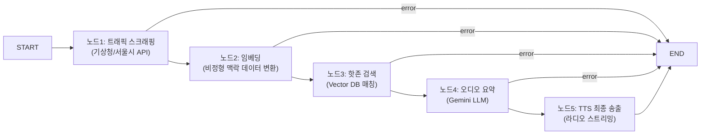

# UNSU Platform API (Backend) 개발 가이드

> **목적:** 프리미엄 택시 기사 플랫폼의 백엔드 시스템인 Node.js + LangGraph 기반 자율 상태 머신, 외부 연동(핀테크/공공 API), 보안 정책을 정의합니다.

---

## 1. 아키텍처 개요 및 기술 스택

| 항목 | 기술 | 비고 |
|---|---|---|
| 런타임 | Node.js (TypeScript) | - |
| 프레임워크 | Express | REST API 및 SSE 스트리밍 라우팅 |
| 에이전트 엔진 | `@langchain/langgraph` | LangChain 상태 머신 파이프라인 |
| LLM | Google Gemini API (`gemini-2.5-flash`) | 비용 효율적 스트리밍 추론 |
| 데이터베이스 | Supabase (PostgreSQL) | 주행 궤적 비동기 적재 및 LangGraph Checkpointer 연동 |
| 관제 | LangSmith | 에이전트 추적 및 런타임 결함 분석 |
| 유효성 검증 | Zod | 인바운드 페이로드 및 LLM 아웃바운드 검증 |

---

## 2. LangGraph 단일 책임 노드(SRP) 아키텍처

G-PAN(지능형 오디오 관제 엔진) 작동을 위한 선형 에이전트 파이프라인입니다.

### 2-1. 상태 흐름도 (State Flow)



### 2-2. 결함 격리 가드레일 (Cost Control)
> [!IMPORTANT]
> 각 노드는 **단일 책임(Single Responsibility)** 원칙을 가지며, 외부 API 실패 혹은 LLM 환각(Hallucination) 감지 시, 제어권을 `State.Error`로 즉시 넘기고 다음 노드로의 진입을 막아 불필요한 LLM API 비용 폭증을 원천 차단합니다.

```typescript
// workflow.ts 에러 분기 라우팅 패턴
workflow.addConditionalEdges("trafficScrapeNode", (state: AgentState) => {
  return state.error ? END : "embeddingNode";
});
```

---

## 3. 외부 API 게이트웨이 및 연동 규칙

UNSU 플랫폼의 가치를 창출하는 핵심 외부 브로커 연동 지침입니다.

### 3-1. Tax Autopilot 연동 (CODEF / 쿠콘 API)
여신금융협회 카드 매출 및 차량 유지비 매입 데이터를 스크래핑하여 국세청 홈택스 포맷으로 융합합니다.
*   **보안 원칙**: 핀테크 브로커 API Key(`KUCON_API_BROKER_KEY`)는 `.env`로 철저히 격리하며 프론트엔드에 절대 노출하지 않습니다.
*   **실시간 동기화 금지**: 금융 데이터는 레이턴시가 긺으로 비동기 배치 작업이나 큐(Queue)를 통해 수집하고 프론트엔드에는 캐싱된 데이터를 즉각 응답합니다.

### 3-2. G-PAN 맥락 데이터 수집 (기상청 / 돌발 트래픽)
*   **비동기 융합**: 여러 공공 API를 Promise.all 등 병렬 비동기 호출로 병합 수집하여 병목을 줄입니다.
*   **에러 폴백**: 공공 API 타임아웃 발생 시, 기존의 예측된 핫존 데이터를 내려주는 캐시 폴백 로직을 필수로 탑재합니다.

---

## 4. 백엔드 보안 및 유효성 검증

### 4-1. Zod 스키마 런타임 검사 강제
클라이언트(FO/BO)의 모든 요청 Payload와 외부 API 연동 반환값은 Zod 스키마를 통과해야 합니다.

```typescript
const FinTechSyncPayloadSchema = z.object({
  driverId: z.string().uuid(),
  syncPeriod: z.enum(['daily', 'monthly', 'yearly']),
});

// 미들웨어 예시
const validated = FinTechSyncPayloadSchema.parse(req.body); // 실패 시 ZodError throw
```

### 4-2. URL 검증 (WHATWG 표준)
추천 코스나 외부 제휴 상점으로 리다이렉션 되는 아웃링크 URL 생성 시 `WHATWG URL` 모듈로 프로토콜을 화이트리스트 필터링(`http:`, `https:`)합니다.

---

## 5. 관제 및 영속성 (Observability & Persistence)

### 5-1. Supabase Checkpointer
LangGraph의 에이전트 실행 상태와 드라이버의 세션 정보 이력 복구를 위해 `@langchain/langgraph-checkpoint-postgres`를 연동하여 상태를 DB에 보존합니다.

### 5-2. LangSmith 추적 (Tracing)
플랫폼의 AI 런타임 품질 보증을 위해 루트 `.env`에 설정된 LangSmith 변수를 통해 내부 프롬프트와 토큰 비용을 실시간 모니터링합니다. (절대 클라이언트 측에서는 로깅 SDK를 호출하지 않음)

```env
LANGCHAIN_TRACING_V2=true
LANGCHAIN_API_KEY=ls__unsu_enterprise_secret_stream
LANGCHAIN_PROJECT=unsu-platform-core-prod
```
