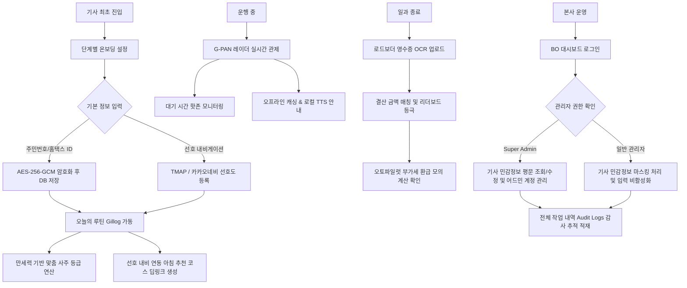

# UNSU 플랫폼 비즈니스 및 운영 프로세스 전체 가이드라인

본 가이드는 UNSU 플랫폼의 프론트오피스(FO) 및 백오피스(BO), 백엔드 API, 그리고 AI 에이전트 레이어가 유기적으로 동작하는 전체 비즈니스 및 기술 운영 프로세스를 정의합니다.

---

## 1. 플랫폼 비즈니스 전체 흐름도

---

## 2. 세부 단계별 운영 및 기술 절차

### 단계 1: 기사 온보딩 및 마스터 프로필 등록 (FO)
1. **온보딩 화면 진입**: 최초 기사는 모바일 웹([FO Onboarding](http://localhost:5173/onboarding))에 진입하여 가입을 진행합니다.
2. **시니어 맞춤형 UX 입력**: 생년월일(8자리 입력 시 `-` 자동 삽입), 태어난 시간(4자리 입력 시 `:` 자동 삽입), 영업구분(개인/모범)을 입력합니다.
3. **내비게이션 및 세무 정보 설정**:
   * 선호하는 모바일 내비게이션(TMAP 또는 카카오네비)을 선택합니다.
   * 세무 정산 오토파일럿 가동을 위해 국세청 홈택스 ID를 입력합니다.
4. **백엔드 암호화 연동**:
   * `hometax_id`는 백엔드 전송 즉시 **AES-256-GCM** 방식으로 암호화되어 임의 유출이 불가능한 구조로 데이터베이스에 저장됩니다.

---

### 단계 2: 일과 시작 - 오늘의 루틴 브리핑 (FO)
1. **메인 페이지 진입**: 기사가 출근 시 [오늘의 루틴 (Gillog)](http://localhost:5173/) 화면을 켭니다.
2. **사주 만세력 알고리즘 연동**:
   * 외부 사주 API의 과도한 호출 비용을 줄이기 위해, 백엔드 내부의 **정적 만세력 연산** 모듈이 기사의 생일과 오늘 일진을 조합하여 일일 운세 등급(**최상, 상, 우수, 평온**)을 계산합니다.
   * 운세 등급에 따라 당일 기사에게 어울리는 맞춤형 행운의 동선(예: "동남쪽 강남구 부근을 주시하세요")을 내러티브 텍스트로 생성해 기사에게 보여줍니다.
3. **추천 코스 및 선호 내비 딥링크 연동**:
   * 실시간 교통망 흐름에 따라 선정된 추천 목적지가 화면에 노출됩니다.
   * 기사가 **"추천 경로 전송"** 버튼을 누르면, 온보딩 때 선택한 내비 preference 설정에 따라 **티맵 앱 인텐트(`tmap://`)** 또는 **카카오네비 딥링크(`kakaonavi://`)**가 동적으로 호출되어 길 안내가 즉시 실행됩니다.

---

### 단계 3: 운행 중 - G-PAN 레이더 관제 및 결함 대응 (FO)
1. **실시간 관제 데이터 수집**: [G-PAN 레이더](http://localhost:5173/gpan) 화면에서 주변 주요 핫존(예: 강남역, 김포공항)의 대기 대수 및 예상 대기 시간을 실시간 확인합니다.
2. **로컬 TTS 합성 (비용 및 음영구역 대응)**:
   * 음성 낭독(`ON AIR` 방송) 시 대용량 파일 스트리밍 대신 프론트엔드 브라우저의 HTML5 내장 **Web Speech API**를 활용하여 기기의 로컬 음성 합성 엔진으로 정보를 읽어줍니다.
   * 이동 중 네트워크 단절 시에도 TTS 안내가 중간에 끊기지 않습니다.
3. **네트워크 장애 감지 및 캐시 복구**:
   * 백엔드 API 서버 연결 오류 발생 시, 화면이 깨지는 대신 `⚠️ LOCAL CACHE ACTIVE` 경고 인디케이터를 띄우고, 로컬 스토리지에 캐싱되어 있던 마지막 정상 데이터를 복구해 중단 없이 정보를 노출합니다.

---

### 단계 4: 일과 종료 - OCR 인증 및 오토파일럿 경영 관리 (FO)
1. **영수증 업로드**: [커뮤니티 및 OCR (Roadboarder)](http://localhost:5173/plaza) 화면에서 영수증을 인증합니다.
2. **카메라/갤러리 멀티 선택**: 촬영 규격을 강제하지 않아 실시간 카메라 촬영과 로컬 갤러리/폴더에 저장된 파일 업로드를 모두 지원합니다.
3. **매출 매칭 및 리더보드 등극**:
   * 업로드된 이미지에서 매출 금액과 날짜를 OCR 판독하여 데이터베이스에 실시간 기록하고, 해당 기사는 즉시 리더보드 순위표에 등극합니다.
4. **오토파일럿 부가세 환급 산식 가동**:
   * [정산 대시보드 (Autopilot)](http://localhost:5173/autopilot)에서 개인택시 간이과세자 전용 세액 산식이 상시 작동되어, 기사가 실시간으로 모의 환급액 추이를 체크하며 리텐션을 유지합니다.

---

### 단계 5: 플랫폼 운영 - 백오피스 관제 및 감사 추적 (BO)
1. **관리자 로그인 및 권한 세션**: [BO 대시보드](http://localhost:5174/) 진입 시 초기 관리자 권한으로 로그인합니다. 세션에 관리자 권한(`Super Admin`, `Manager`, `Auditor`)이 설정됩니다.
2. **관리자 계정 추가 및 정보 변경**:
   * 사이드바 하단의 **"관리자 계정 관리"**를 클릭하여 새로운 운영자를 등록하거나 정보를 수정할 수 있습니다.
   * `Super Admin` 계정만 수정/삭제 권한을 보유하며, 변경 시 이전/이후 세부 사항이 `ADMIN_UPDATE` 로그로 자동 기록됩니다.
   * 우측 **"이력"** 버튼을 클릭하면, 해당 관리자가 생성/변경/삭제된 모든 감사 이력이 팝업 테이블로 상세 조회됩니다.
3. **기사 개인정보(PII) 마스킹 보안 가이드**:
   * **Super Admin**: 기사의 암호화된 홈택스 식별 ID를 복호화된 평문으로 그대로 조회하고 수정할 수 있습니다.
   * **일반 관리자**: 기사 정보 진입 시 홈택스 ID의 뒷자리가 전체 마스킹(`123-**-*****`) 처리되며, 수정 폼 인풋 필드도 `readOnly` 및 `disabled`로 잠금 처리되어 임의 조작이 방지됩니다.
4. **감사 로그(Audit Logs) 및 API Playground**:
   * [감사 로그 대시보드](/audit-logs)에서 `LOGIN`, `ADMIN_CREATE`, `ADMIN_UPDATE`, `ADMIN_DELETE`, `DRIVER_UPDATE` 등 모든 내역이 영구 보존됩니다.
   * [API 테스트베드](/api-playground)를 통해 백엔드 연동 상태 및 LangGraph 기반 실시간 AI 운행 추천 SSE 스트리밍 데이터를 직접 시뮬레이션하고 응답 상태를 검증할 수 있습니다.

---

### 단계 6: 회원 탈퇴 및 재가입 방지 (E2E)
1. **회원 탈퇴 처리**: 기사가 마스터 설정에서 탈퇴 요청 시 기사의 PII 데이터는 CASCADING DELETE 정책에 따라 완전 파쇄됩니다.
2. **3일 해시 락(Hash Lock) 등록**:
   * 주민번호(홈택스 ID)를 복원할 수 없는 SHA-256 값으로 해싱한 고유 식별 해시값과 탈퇴 일시만 `withdrawn_drivers` 테이블에 보존합니다.
3. **재가입 차단**:
   * 탈퇴 후 3일 이내 재가입을 시도할 경우 온보딩 페이지에서 `탈퇴 후 3일간은 재가입이 불가능합니다.` 라는 안내와 함께 정확히 가입이 해제되는 일시를 출력하며 가입 시도를 원천 차단합니다.
