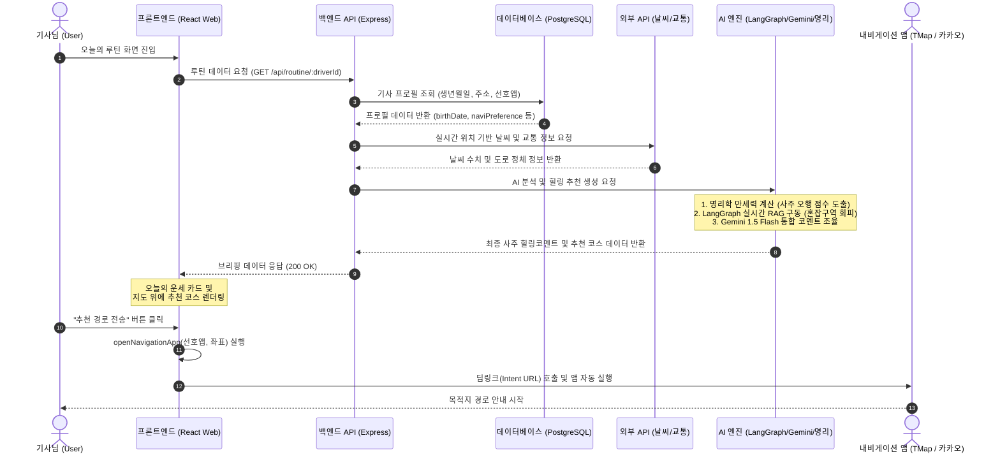
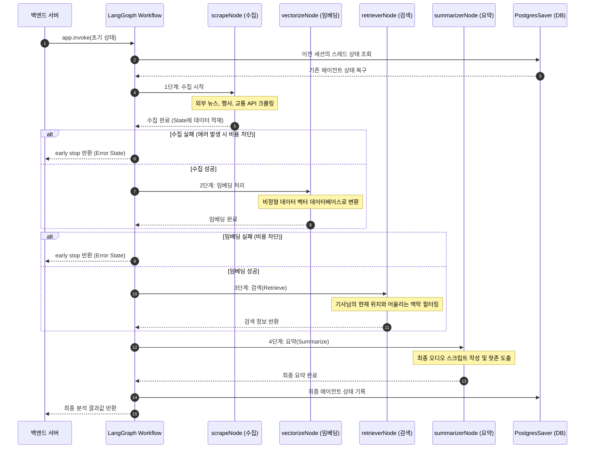
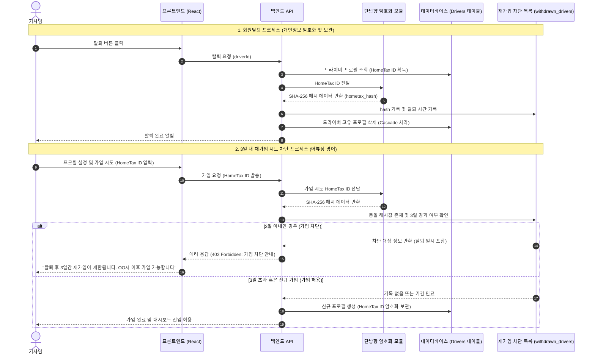

# 📊 운수대통 플랫폼 비즈니스 및 핵심 AI 로직 시퀀스 다이어그램 (Mermaid)

본 문서는 운수대통(UNSU) 플랫폼의 PT 발표용 다이어그램 정보를 포함하고 있습니다. 시스템 컴포넌트 간의 데이터 흐름과 호출 순서를 직관적으로 보여주는 **순차 다이어그램(Sequence Diagram)** 형태로 통일하여 구성했습니다.

---

## 1. 🔄 전체 서비스 아키텍처 & 비즈니스 연동 흐름
사용자(기사님)의 요청에서 시작해 백엔드 API, 외부 연동계, 그리고 AI 분석 엔진이 실시간으로 조화를 이루며 길안내 앱으로 이어지는 전체 시퀀스 다이어그램입니다.

---

## 2. 🧠 LangGraph 에이전트 핵심 AI 파이프라인 흐름
웹에서 실시간으로 환경 요소를 파싱하여 최적의 영업 핫존을 정제해나가는 AI 파이프라인의 실시간 데이터 처리 시퀀스 다이어그램입니다.

---

## 3. 🔒 회원탈퇴 및 재가입 제한 보안 흐름
정산 혜택만 받고 탈퇴하는 기적의 체리피커 기사를 감지하고, 개인정보(홈택스 ID) 유출 리스크를 방어하는 보안 흐름 시퀀스 다이어그램입니다.

