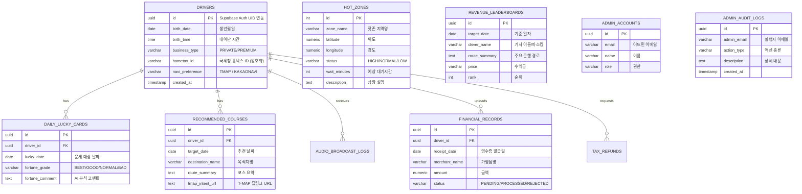
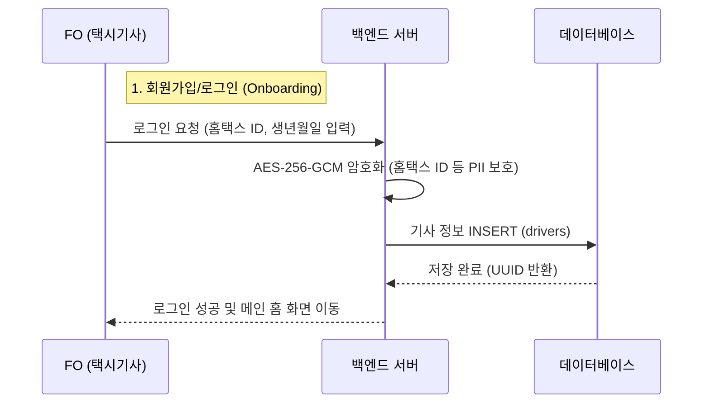
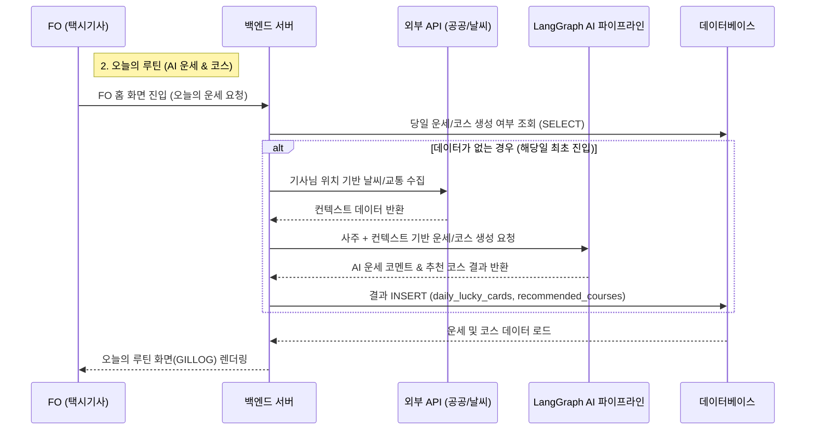
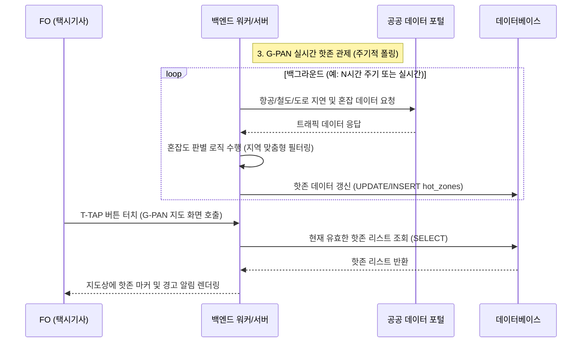
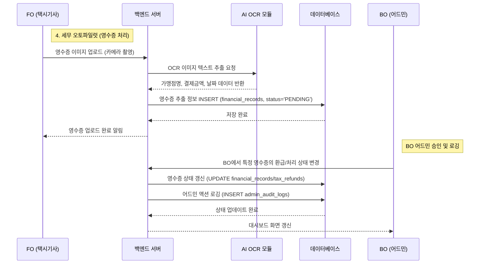

# UNSU 플랫폼 데이터베이스(DB) 설계 산출물 및 데이터 흐름도

본 문서는 UNSU 플랫폼(FO 및 BO)의 데이터베이스 컬럼 명세, 각 데이터가 저장되는 시점(Lifecycle), 그리고 연동되는 메뉴를 정리한 산출물입니다.

## 1. 개체-관계 다이어그램 (ERD)

---

## 2. 테이블 상세 명세 및 데이터 저장 시점 (Lifecycle)

각 테이블의 데이터가 어느 시점에 DB에 `INSERT/UPDATE` 되는지, 그리고 어떤 메뉴 화면에 노출되는지를 정리했습니다.

### [1] 기사 온보딩 및 계정 (`drivers`)
**📌 메뉴 매핑:** FO (Front-Office) 앱 진입 및 로그인 화면
- **id**: Supabase Auth와 1:1 매핑되는 UUID
- **birth_date / birth_time**: 기사님의 사주 정보를 바탕으로 AI 운세를 분석하기 위한 기본 데이터.
- **business_type**: 일반개인(PRIVATE) / 모범(PREMIUM) 구분.
- **hometax_id**: 홈택스 연동 및 세무 처리를 위한 ID (AES-256-GCM 암호화 저장).
- **저장 시점:** 
  - **FO (앱) > 최초 로그인 및 온보딩 시점:** 사용자가 온보딩 폼에 생년월일, 홈택스 ID 등을 입력하고 `[시작하기]` 버튼을 누를 때 DB에 `INSERT` 됩니다.

### [2] 오늘의 루틴 - AI 운행 분석 (`daily_lucky_cards`)
**📌 메뉴 매핑:** FO > 홈(길로그) > "오늘의 루틴 (AI 운행 분석)"
- **lucky_date**: 운세가 발급된 날짜.
- **fortune_grade**: AI가 산출한 운세 등급 (BEST, GOOD, NORMAL, BAD/Calm).
- **fortune_comment**: 기사님의 생년월일시 데이터와 당일 날씨, 교통상황 등을 융합하여 LLM이 생성한 맞춤형 브리핑 코멘트.
- **저장 시점:** 
  - **FO (앱) > 매일 최초 홈 화면 진입 시:** 해당 날짜(`lucky_date`)의 운세 데이터가 DB에 없다면 백그라운드에서 LangGraph 기반 AI 파이프라인이 구동되어 결과를 생성한 뒤 `INSERT` 합니다. (이후에는 캐시/DB에서 `SELECT` 하여 보여줌)

### [3] 오늘의 루틴 - AI 코스 추천 (`recommended_courses`)
**📌 메뉴 매핑:** FO > 홈(길로그) > "AI 코스 추천"
- **destination_name / route_summary**: AI가 추천하는 최적의 목적지와 경로 설명.
- **tmap_intent_url**: T-MAP으로 즉시 안내를 시작할 수 있는 App Scheme (딥링크) URL.
- **저장 시점:**
  - **FO (앱) > AI 운행 분석 직후 연계 생성:** 운세 데이터가 생성됨과 동시에, 기사님의 현재 위치 및 외부 API(공공데이터, 행사정보 등)를 기반으로 코스를 산출하여 `INSERT` 합니다.

### [4] G-PAN 실시간 관제 / 핫존 (`hot_zones`)
**📌 메뉴 매핑:** FO > T-TAP (G-PAN 레이더) / BO > 대시보드 및 G-PAN 관제
- **latitude / longitude / zone_name**: 핫존의 중심 좌표와 지역 이름.
- **status / wait_minutes**: 혼잡도 등급(HIGH 등)과 예상 대기 시간.
- **저장 시점:**
  - **BO (백엔드) > 주기적 폴링 및 캐싱:** 4시간 단위 또는 외부 API 관제 모듈이 공공 API(교통, 항공, 철도) 데이터를 수집/정제하여 핫존을 식별하고 DB에 갱신(`UPDATE` 또는 `INSERT`) 합니다.

### [5] 로드보더 - 수익금 리더보드 (`revenue_leaderboards`)
**📌 메뉴 매핑:** FO > 로드보더 (커뮤니티/리더보드)
- **driver_name / price**: 마스킹된 기사 이름(예: 서울 개인 98**)과 당일/주간 수익금.
- **rank**: 리더보드 랭킹 순위.
- **저장 시점:**
  - **BO (백엔드) > 배치 잡 (Batch Job):** 매일 자정 또는 특정 주기로 기사들의 결제/운행 데이터를 집계하여 순위를 매긴 후 DB에 `INSERT/UPDATE` 합니다.

### [6] 세무 오토파일럿 - 영수증 및 환급 (`financial_records`, `tax_refunds`)
**📌 메뉴 매핑:** FO > 마이페이지 > 영수증 등록 / BO > Tax Autopilot Monitor
- **receipt_date / merchant_name / amount**: 영수증 내역 정보.
- **status**: 승인 대기, 처리 완료 등 세무 환급 상태.
- **저장 시점:**
  - **FO (앱) > 영수증 사진 업로드 시:** 기사가 영수증을 촬영하여 업로드하면, 백엔드에서 OCR(Vision API)을 통해 데이터를 추출한 뒤 DB에 `INSERT` 합니다.
  - **BO (어드민) > 상태 변경 시:** 어드민에서 해당 영수증의 환급/처리 상태를 변경하면 `UPDATE` 됩니다.

### [7] 어드민 계정 및 감사 로그 (`admin_accounts`, `admin_audit_logs`)
**📌 메뉴 매핑:** BO (Back-Office) > 권한 관리 및 모니터링 메뉴
- **action_type / target_identifier / description**: 어드민이 수행한 액션(예: 기사 정보 조회, 외부 API 상태 변경)의 상세 내역.
- **저장 시점:**
  - **BO (어드민) > 주요 액션 수행 시:** 어드민 사용자가 로그인, 기사 데이터 접근, 시스템 설정 변경 등을 수행할 때 보안 및 추적을 위해 즉각적으로 `admin_audit_logs`에 `INSERT` 됩니다.

---

## 3. 요약 (Data Flow Summary)

1. **[회원가입/로그인 시점]** `drivers` 테이블에 기사 프로필 저장
2. **[매일 앱 최초 접속 시점]** LangGraph AI가 `daily_lucky_cards` (운세)와 `recommended_courses` (코스 추천)를 생성 및 저장
3. **[수시/주기적 폴링 시점]** 백엔드 워커가 외부 API 데이터를 기반으로 `hot_zones` 생성 및 갱신
4. **[영수증 업로드 시점]** OCR 텍스트 추출 후 `financial_records` 테이블에 비용/세무 정보 저장
5. **[어드민 업무 시점]** 모든 BO 상의 변경 사항 및 접근 기록은 `admin_audit_logs`에 감사 로그로 저장

---

## 4. 핵심 액션 순서도 (Action Flowcharts)

각 도메인별 핵심 액션이 언제 시작되고 어느 시점에 DB에 반영되는지 보여주는 시퀀스 다이어그램입니다.

### 4.1 기사 온보딩 및 로그인 (Onboarding)
기사님이 최초 로그인 시 개인 정보와 홈택스 연동 ID를 입력하고 데이터베이스에 암호화되어 저장되는 흐름입니다.

### 4.2 일일 루틴: AI 운세 및 코스 추천 (Daily Routine)
매일 기사님이 앱을 처음 켤 때, LangGraph AI 파이프라인이 기사님의 사주와 실시간 날씨/교통 상황을 융합하여 운세와 추천 코스를 DB에 저장하는 흐름입니다.

### 4.3 G-PAN 실시간 관제 및 핫존 업데이트 (Hot Zones)
백엔드에서 주기적으로 공공데이터 API를 호출하여, 혼잡도가 높은 지역(핫존)을 선별한 뒤 DB를 업데이트하고 프론트에 뿌려주는 흐름입니다.

### 4.4 세무 오토파일럿: 영수증 업로드 및 어드민 감사 (Tax Autopilot)
기사가 주유/수리 영수증을 촬영하면 AI-OCR이 내용을 추출하여 DB에 저장하고, 어드민이 이를 검토하는 흐름입니다. 이 과정에서 어드민의 모든 액션은 감사 로그에 저장됩니다.

