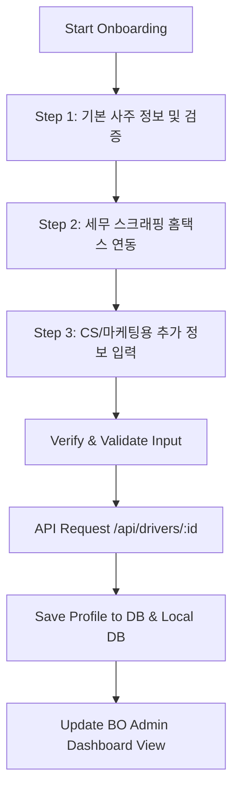

# 기사 가입 유효 범위 검증 및 추가 정보 수집/관리 연동 계획서

본 계획서는 기사 마스터 가입 시 생년월일과 시간의 입력 값 범위를 정상 범위로 제한하는 유효성 검증을 도입하고, PUSH/마케팅 및 CS 처리를 위해 기사의 추가 정보(이름, 전화번호, 차종, 차량번호, 이메일, 주소)를 수집하여 DB, API, 온보딩 화면, 백오피스(BO) 대시보드 전 계층에 연동하기 위한 설계서입니다.

## User Review Required

> [!IMPORTANT]
> **1. 데이터 유효성 검증 정책**
> * **생년월일**: 1930년 이후부터 현재 연도까지만 정상 입력 가능하도록 검증을 도입합니다.
> * **출생 시간**: `00:00`부터 `23:59` 사이의 올바른 시/분 포맷만 통과시킵니다.
>
> **2. 추가 정보 컬럼 확장 정책**
> * 마케팅 및 CS 대응을 위해 `drivers` 테이블에 다음 6개 컬럼을 추가합니다:
>   * `name` (이름, `VARCHAR(50)`)
>   * `phone_number` (전화번호, `VARCHAR(20)`)
>   * `car_model` (차종, `VARCHAR(50)`)
>   * `car_number` (차량번호, `VARCHAR(20)`)
>   * `email` (이메일, `VARCHAR(100)`)
>   * `address` (주소, `TEXT`)
> * 기존 기사들의 하위 호환성을 위해 DB 컬럼은 `NULL` 허용으로 추가하며, 신규 가입 시에는 프론트엔드 및 Zod에서 필수값으로 검증합니다.

## Graph Planning

## Proposed Changes

---

### [Component 1] 데이터베이스 스펙 확장

#### [MODIFY] [database_schema.sql](file:///d:/000_UNSU/database_schema.sql)
* `public.drivers` 테이블 정의에 `name`, `phone_number`, `car_model`, `car_number`, `email`, `address` 컬럼 선언 추가.

---

### [Component 2] 백엔드 유틸 및 API 구현 (`api`)

#### [MODIFY] [db.ts](file:///d:/000_UNSU/api/src/utils/db.ts)
* **`Driver` 인터페이스 확장**: 신규 6개 필드 추가.
* **`runMigrations` 내 자동 마이그레이션**: DB 기동 시 `drivers` 테이블에 새로운 6개 컬럼을 `ALTER TABLE ... ADD COLUMN IF NOT EXISTS`로 자동 주입하는 쿼리 추가.
* **`saveDriverProfile` 및 `getDriverProfile`**: 신규 컬럼 6종을 쿼리 및 로컬 백업 파일 바인딩에 맞게 반영.

#### [MODIFY] [server.ts](file:///d:/000_UNSU/api/src/server.ts)
* **Zod 검증 스키마 (`DriverProfileInputSchema`) 고도화**:
  * 생년월일(1930년~현재연도) 및 시간(00:00~23:59) 유효 범위 검증(`refine`) 추가.
  * 신규 추가 필드 6종 검증 스펙(이메일 포맷 등) 결합.
* **`POST /api/drivers/:id` 및 `POST /api/admin/drivers/:id`**: 새로운 6종 파라미터를 받아 DB에 저장하도록 구현 수정.

---

### [Component 3] 프론트엔드 클라이언트 (`fo`)

#### [MODIFY] [OnboardingPage.tsx](file:///d:/000_UNSU/fo/src/pages/OnboardingPage.tsx)
* **가입 폼 상태(`formData`) 확장**: 이름, 전화번호, 차종, 차량번호, 이메일, 주소 추가.
* **온보딩 3단계 추가**:
  * 기존 `STEP 1/2` 구조에서 `STEP 1/3` 구조로 개편.
  * `STEP 3`: '추가 정보 입력' 코너 신설 및 기입 화면 구현.
* **생년월일/시간 범위 유효성 예외 처리**: 사용자가 유효 범위를 넘는 값을 입력한 경우 화면에 직관적인 에러 출력.

---

### [Component 4] 통합 관리 백오피스 (`bo`)

#### [MODIFY] [App.tsx](file:///d:/000_UNSU/bo/src/App.tsx)
* **`DriverManagement` 컴포넌트 확장**:
  * 기사 프로필 요약 카드에 신규 추가 필드 6종(이름, 연락처, 차종, 차량번호, 이메일, 주소) 정보 노출.
  * 수정 에디터 폼에 신규 추가 필드 입력 영역 추가 및 API 전송 바인딩.
* **API Playground 스펙 템플릿**: 등록/수정 요청 바디 템플릿에 추가 필드 구조 적용.

---

## Verification Plan

### Automated Tests
* `POST /api/drivers/test-id`를 비정상 날짜/시간으로 호출할 경우 Zod Validation 에러가 정상적으로 차단 반환되는지 검증합니다.
* 정상 데이터를 담아 호출 시 DB 및 `local_db.json` 파일에 추가 6대 필드가 정상 저장되는지 확인합니다.

### Manual Verification
1. http://localhost:5173/onboarding 페이지로 이동해 3단계 추가 정보 화면이 정상 노출되는지 점검합니다.
2. 회원 가입 완료 후 http://localhost:5174 (BO 관리자 화면)의 '기사 회원 정보 관리' 탭에서 가입된 기사 정보를 검색하여 신규 추가 정보가 올바르게 복호화 및 조회/수정되는지 검증합니다.
