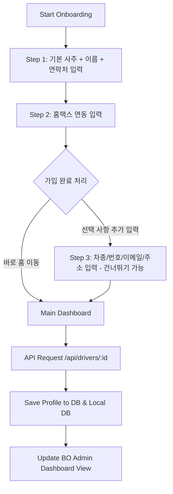

# 기사 가입 유효 범위 검증 및 추가 정보 수집/관리 연동 계획서 (피드백 반영 버전)

본 계획서는 기사 마스터 가입 시 생년월일과 시간의 입력 값 범위를 정상 범위로 제한하는 유효성 검증을 도입하고, 가입 단계를 2단계 필수 입력 및 3단계 추가 선택(Optional) 구조로 개편하여 기사의 추가 정보(이름, 전화번호, 차종, 차량번호, 이메일, 주소)를 수집하여 DB, API, 온보딩 화면, 백오피스(BO) 대시보드 전 계층에 연동하기 위한 설계서입니다.

## User Review Required

> [!IMPORTANT]
> **1. 데이터 유효성 검증 정책**
> * **생년월일**: 1930년 이후부터 현재 연도까지만 정상 입력 가능하도록 검증을 도입합니다.
> * **출생 시간**: `00:00`부터 `23:59` 사이의 올바른 시/분 포맷만 통과시킵니다.
>
> **2. 가입 단계 간소화 및 추가 정보 수집 정책 (피드백 반영)**
> * **필수 가입 (2단계 완료)**:
>   * **STEP 1**: 사주 및 개인정보 (생년월일, 출생시간, 택시 종류, 선호 내비) + **이름(Name)** 및 **전화번호(Phone Number)** (내비 연동 및 CS 확인을 위해 필수 수집).
>   * **STEP 2**: 세무 연동을 위한 **홈택스 아이디(HomeTax ID)**. (입력 완료 시 가입 프로세스 완료 및 메인 홈 이동 가능)
> * **선택 입력 (STEP 3: 가입 완료 후 선택)**:
>   * 가입 완료 후 추가 정보 기입 페이지를 띄우거나 건너뛰기(Skip) 가능하도록 구현합니다.
>   * 대상 필드: **차종(Car Model)**, **차량번호(Car Number)**, **이메일(Email)**, **주소(Address)**.
> * **차종 선택 UI 고도화**:
>   * 주요 차종 드롭다운 메뉴 제공 (현대 그랜저, 현대 쏘나타, 현대 아이오닉 5, 기아 K8, 기아 K5, 기아 EV6 등).
>   * '기타 (직접 입력)' 옵션을 두어, 선택 시 텍스트 인풋 필드가 활성화되도록 유연하게 구현합니다.

## Graph Planning

## Proposed Changes

---

### [Component 1] 데이터베이스 스펙 확장

#### [MODIFY] [database_schema.sql](file:///d:/000_UNSU/database_schema.sql)
* `public.drivers` 테이블 정의에 `name`, `phone_number`, `car_model`, `car_number`, `email`, `address` 컬럼 선언 추가 (기존 기사 호환을 위해 `NULL` 허용).

---

### [Component 2] 백엔드 유틸 및 API 구현 (`api`)

#### [MODIFY] [db.ts](file:///d:/000_UNSU/api/src/utils/db.ts)
* **`Driver` 인터페이스 확장**: 신규 6개 필드 추가.
* **`runMigrations` 내 자동 마이그레이션**: DB 기동 시 `drivers` 테이블에 새로운 6개 컬럼을 `ALTER TABLE ... ADD COLUMN IF NOT EXISTS`로 자동 주입.
* **`saveDriverProfile` 및 `getDriverProfile`**: 신규 컬럼 6종을 SQL 쿼리 및 로컬 파일 fallback 처리에 연동.

#### [MODIFY] [server.ts](file:///d:/000_UNSU/api/src/server.ts)
* **Zod 검증 스키마 (`DriverProfileInputSchema`) 고도화**:
  * 생년월일(1930년~현재연도) 및 시간(00:00~23:59) 범위 검증 추가.
  * 필수 항목: `name`, `phoneNumber` 추가.
  * 선택 항목(Optional): `carModel`, `carNumber`, `email`, `address` 추가.
* **`POST /api/drivers/:id` 및 `POST /api/admin/drivers/:id`**: 새로운 6종 파라미터를 받아 DB에 저장하도록 덮어쓰기 구현.

---

### [Component 3] 프론트엔드 클라이언트 (`fo`)

#### [MODIFY] [OnboardingPage.tsx](file:///d:/000_UNSU/fo/src/pages/OnboardingPage.tsx)
* **가입 폼 상태(`formData`) 확장** 및 유효 범위 에러 표시 구현.
* **STEP 1 개편**: 이름, 전화번호 입력 필드 추가 (정규식 기반 포맷 자동 하이픈 변환).
* **STEP 2 완료 시 가입 API 호출**: API 저장에 성공하면 STEP 3(추가정보 입력)로 진입할지 여부를 묻는 구조 제공.
* **STEP 3 추가**: '추가 선택 정보' 코너 신설.
  * 차종 브랜드 드롭다운 및 직접 입력 인풋 구성.
  * 건너뛰기(Skip) 버튼 제공하여 바로 홈 화면으로 갈 수 있게 구성.
  * 저장 시 백엔드 API 재호출하여 덮어쓰기 완료.

---

### [Component 4] 통합 관리 백오피스 (`bo`)

#### [MODIFY] [App.tsx](file:///d:/000_UNSU/bo/src/App.tsx)
* **`DriverManagement` 컴포넌트 확장**:
  * 기사 정보 카드 및 에디터 폼에 추가 필드 6종(이름, 연락처, 차종, 차량번호, 이메일, 주소) 연동.
* **API Playground 스펙 템플릿**: 등록/수정 요청 바디 템플릿에 추가 필드 구조 적용.

---

## Verification Plan

### Automated Tests
* `POST /api/drivers/test-id`를 정상 데이터로 호출하고 DB 적재 성공 여부를 점검합니다.
* 생년월일/시간이 정상 범위를 이탈할 시 Zod Validation 에러가 제대로 반환되는지 확인합니다.

### Manual Verification
1. http://localhost:5173/onboarding 화면에서 이름/연락처 입력을 포함한 1단계와 홈택스 2단계 설정을 완료합니다.
2. 가입 완료 팝업 이후 '추가 정보 입력'을 건너뛰거나 진행하여 차종 선택기 및 직접 입력 기능이 매끄럽게 돌아가는지 확인합니다.
3. http://localhost:5174 (BO 대시보드) 기사 정보 검색란에서 해당 신규 컬럼들이 정상 바인딩되는지 테스트합니다.
